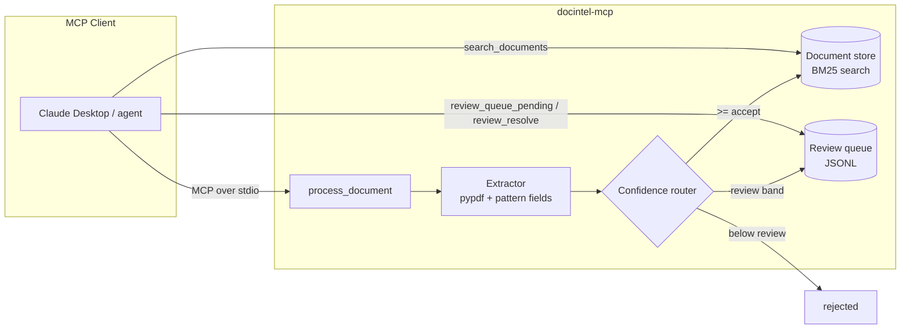

# docintel-mcp

**A Document Intelligence MCP server** — extract text and structured fields from business documents, route low-confidence extractions to a human review queue, and search everything you've processed. Built on the [Model Context Protocol](https://modelcontextprotocol.io) so any MCP client (Claude Desktop, Claude Code, or your own agent) can drive it.

This project packages the operating pattern I've shipped in production document pipelines: **extract → score → route**, with explicit confidence thresholds and a human in the loop for exactly the cases automation shouldn't decide alone.

## Architecture



Every extracted field carries a confidence score and a source snippet, so a reviewer can confirm or correct a value in seconds without reopening the document. Thresholds are explicit and tunable — the difference between a demo and something an operations team will trust.

## Tools exposed

| Tool | What it does |
|---|---|
| `process_document(path)` | Extract text + fields from a `.pdf`/`.txt`/`.md`, route by confidence, index for search |
| `search_documents(query, top_k)` | BM25 keyword search across processed documents |
| `get_document_text(document_id)` | Retrieve extracted text |
| `list_documents()` | List processed documents |
| `review_queue_pending()` | Fields awaiting human review |
| `review_resolve(item_id, corrected_value)` | Record the human-confirmed value |

## Quick start

```bash
git clone https://github.com/reshma449/docintel-mcp.git
cd docintel-mcp
pip install -e ".[dev]"

# run the test suite
pytest

# run the server directly (stdio transport)
docintel-mcp
```

### Connect from Claude Desktop

Add to `claude_desktop_config.json`:

```json
{
  "mcpServers": {
    "docintel": {
      "command": "docintel-mcp",
      "env": {
        "DOCINTEL_ACCEPT_THRESHOLD": "0.85",
        "DOCINTEL_REVIEW_THRESHOLD": "0.30"
      }
    }
  }
}
```

Then ask Claude: *"Process examples/sample_invoice.txt and show me anything that needs review."*

## Configuration

| Env var | Default | Meaning |
|---|---|---|
| `DOCINTEL_ACCEPT_THRESHOLD` | `0.85` | Confidence at or above → auto-accept |
| `DOCINTEL_REVIEW_THRESHOLD` | `0.30` | Confidence at or above (but below accept) → human review |
| `DOCINTEL_REVIEW_QUEUE` | `.docintel/review_queue.jsonl` | Where the review queue persists |

## Design notes

- **Why regex + heuristics instead of an LLM call in the default extractor?** Determinism. The pipeline shape (extract → score → route) is what matters; the `FieldExtractor` protocol in `extraction.py` is a one-method interface, so swapping in an LLM or cloud OCR extractor is a ~20-line change that doesn't touch routing, storage, or the MCP surface.
- **Why JSONL for the review queue?** It's inspectable with `cat`, diffable in git, and importable into a spreadsheet — which is how real review teams actually start before anyone builds them a UI.
- **Why BM25 and not embeddings?** For short business documents, BM25 is strong, explainable ("it matched these terms"), and dependency-free. An embedding index would slot in behind the same `search_documents` tool without changing the client contract.
- **Scanned PDFs** produce an explicit warning instead of a silent empty extraction — silent empties are how bad data reaches dashboards.

## Project layout

```
src/docintel_mcp/
  server.py       # FastMCP server + tool definitions
  extraction.py   # text + field extraction (FieldExtractor protocol)
  confidence.py   # thresholds, routing, review queue
  store.py        # BM25 document store
  models.py       # dataclasses shared across the pipeline
tests/            # unit tests for every module
```

## License

MIT
